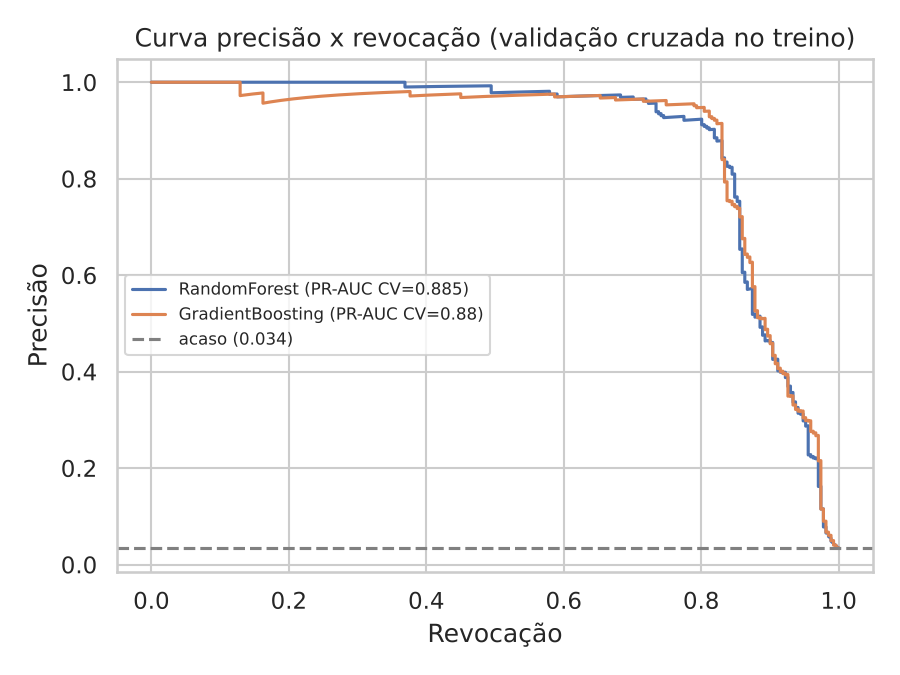
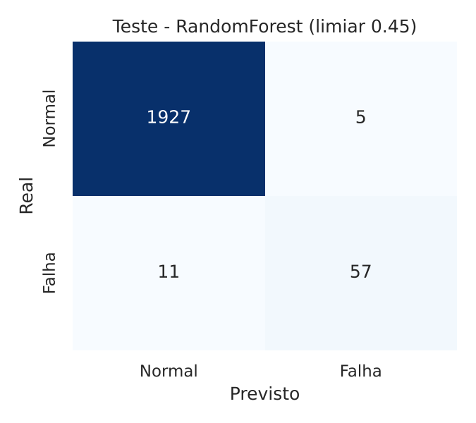
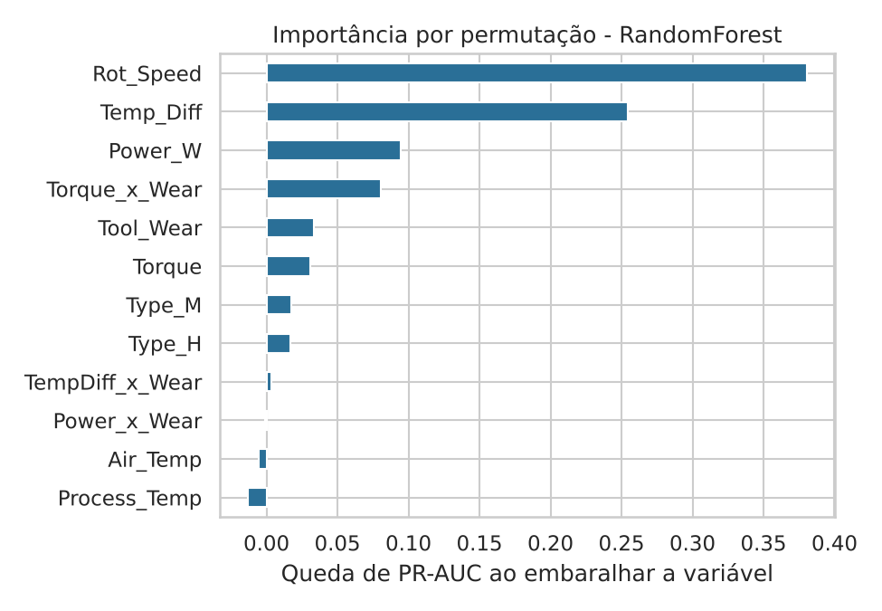

# Manutenção preditiva com o dataset AI4I 2020

Classificação de falhas de máquina a partir de variáveis de processo (temperatura, rotação, torque, desgaste da ferramenta), com foco em **protocolo de validação correto** para uma classe rara (cerca de 3,4% de falhas) e em **escolher o limiar de alarme pelo custo**, não pelo teste.

> **Aviso importante:** o AI4I 2020 é um dataset **sintético**, publicado pela UCI para estudo. As falhas são geradas por regras sobre as variáveis (diferença de temperatura e rotação, potência, desgaste × torque, mais falhas aleatórias). Os resultados abaixo **não provam desempenho em equipamento real**. O objetivo do projeto é demonstrar método, não produto.

## Dados

- 10.000 registros, 339 falhas (3,39%); 3 tipos de produto (L, M, H).
- Fonte: [AI4I 2020 Predictive Maintenance Dataset (UCI)](https://archive.ics.uci.edu/dataset/601/ai4i+2020+predictive+maintenance+dataset). Baixe o `ai4i2020.csv` e passe o caminho ao script.
- As colunas de modo de falha (TWF, HDF, PWF, OSF, RNF) **não** entram como variáveis: usá-las seria vazamento do alvo.

## Variáveis derivadas (por que existem)

| Variável | Fórmula | Motivação física |
|---|---|---|
| `Power_W` | torque × velocidade angular (rad/s) | potência mecânica no eixo |
| `Temp_Diff` | temperatura do processo − temperatura do ar | capacidade de dissipar calor |
| `Torque_x_Wear` | torque × desgaste da ferramenta | esforço acumulado (sobrecarga) |
| `Power_x_Wear`, `TempDiff_x_Wear` | potência ou ΔT × desgaste | interações com o desgaste |

Descartei o produto torque × temperatura do processo de versões anteriores, por não ter sentido físico claro.

## Método

1. Separação estratificada treino/teste (80/20, `random_state=42`).
2. **Hiperparâmetros fixados de antemão**, sem ajuste no teste.
3. Validação cruzada estratificada (5 folds) **só no treino**, gerando previsões fora-da-amostra.
4. **Limiar de decisão escolhido nessas previsões**: máximo F1, e alternativa por custo (premissa: uma falha não detectada custa 10× um alarme falso; ajuste à sua realidade).
5. **Modelo final escolhido pelo PR-AUC da validação cruzada**, não pelo teste.
6. Teste usado **uma única vez**, no final, com intervalo de confiança por bootstrap (o teste tem só 68 falhas).

Modelos: Random Forest e Gradient Boosting (`HistGradientBoostingClassifier`). O script também treina um **XGBoost** se a biblioteca estiver instalada; os resultados abaixo **não** incluem XGBoost, porque ele não pôde ser instalado no ambiente em que rodei.

## Resultados

**Ablação (Random Forest, PR-AUC na validação cruzada do treino)**

| Variáveis | PR-AUC | ROC-AUC |
|---|---|---|
| Brutas (5 sensores + tipo) | 0,720 | 0,968 |
| Brutas + derivadas | 0,885 | 0,977 |

As variáveis derivadas melhoram bastante o PR-AUC. Isso é esperado num dataset cujas falhas nascem de regras sobre potência, ΔT e desgaste × torque: o modelo ganha acesso à forma da regra. Em equipamento real, esse ganho dependeria de a física escolhida refletir o mecanismo real da falha.

**Validação cruzada (treino)**

| Modelo | PR-AUC | ROC-AUC |
|---|---|---|
| Random Forest | 0,885 | 0,977 |
| Gradient Boosting | 0,880 | 0,978 |

Os dois são praticamente equivalentes. Foi escolhido o Random Forest, por ter o maior PR-AUC na validação (diferença pequena, dentro da variação esperada).

**Teste (uso único), Random Forest, limiar 0,453 (máximo F1 na validação)**

| Métrica | Valor | IC 95% (bootstrap) |
|---|---|---|
| Precisão | 0,919 | 0,843 – 0,982 |
| Revocação | 0,838 | 0,742 – 0,922 |
| F1 | 0,877 | |
| PR-AUC | 0,865 | |
| ROC-AUC | 0,983 | |

Matriz de confusão no teste (2.000 registros): 57 falhas detectadas, 11 não detectadas, 5 alarmes falsos, 1.927 normais corretos.

**Limiar por custo (premissa de 10:1):** limiar 0,335, com precisão 0,817 e revocação 0,853 no teste (58 falhas detectadas, 10 perdidas, 13 alarmes falsos). Escolher o limiar por custo troca alguns alarmes falsos a mais por menos falhas perdidas, e o ponto certo depende do custo real de parada versus inspeção.

**Comparação no teste (informativa, não usada para escolher):** o Gradient Boosting teve PR-AUC 0,895 contra 0,865 do Random Forest. Com 68 falhas no teste, essa diferença está dentro do ruído, e por isso não troquei de modelo depois de ver o teste.

**Variáveis mais importantes (importância por permutação no teste):** velocidade de rotação, diferença de temperatura, potência e torque × desgaste. Isso é coerente com a forma como o dataset gera as falhas.





## Limitações

- Dataset sintético, com falhas regidas por regras: os números **não** se transferem para uma planta real.
- Sem dimensão temporal: cada linha é independente. Em manutenção preditiva real, o correto é separar treino e teste **no tempo** e trabalhar com janelas de séries temporais.
- Poucas falhas no teste (68): os intervalos de confiança são largos.
- A razão de custo 10:1 é uma premissa ilustrativa.

## Como rodar

```bash
pip install pandas numpy scikit-learn matplotlib seaborn   # opcional: xgboost
python predictive_maintenance_ai4i.py ai4i2020.csv saida/
```

O script grava as figuras e um `results.json` com todos os números na pasta de saída.

## Próximos passos

- Repetir o protocolo com dados reais de série temporal, ou com dados do pipeline IIoT (ESP32, MQTT e banco de séries temporais) que estou montando.
- Calibrar as probabilidades e comparar custos com dados reais de parada.
